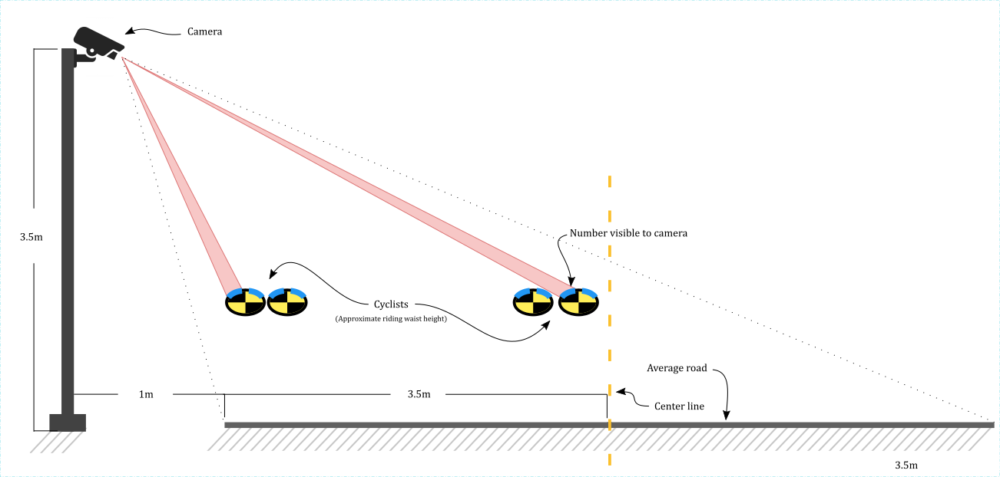
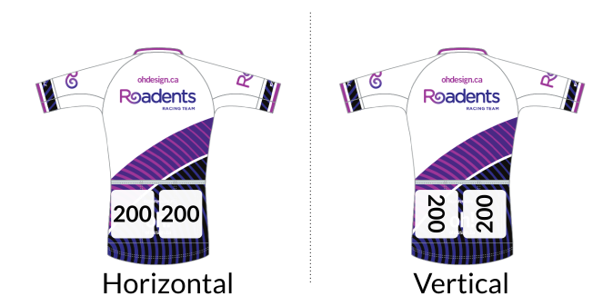
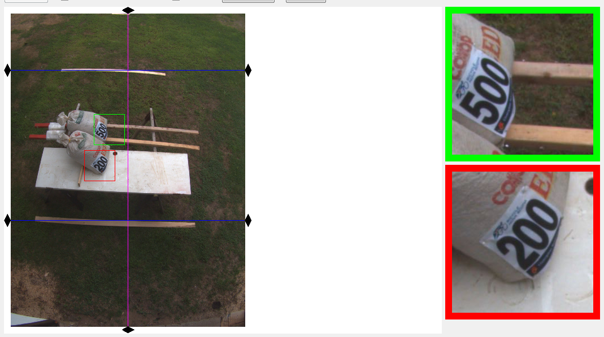
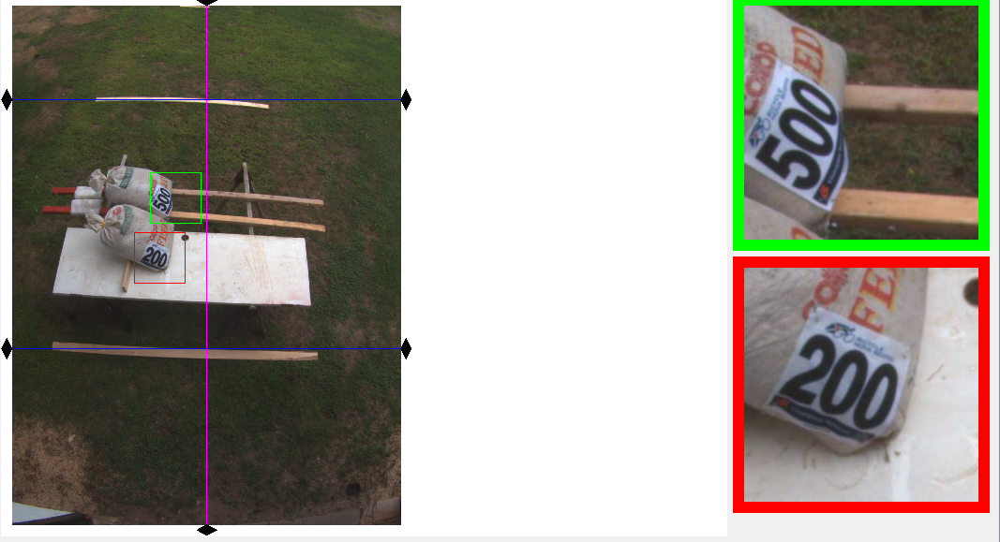
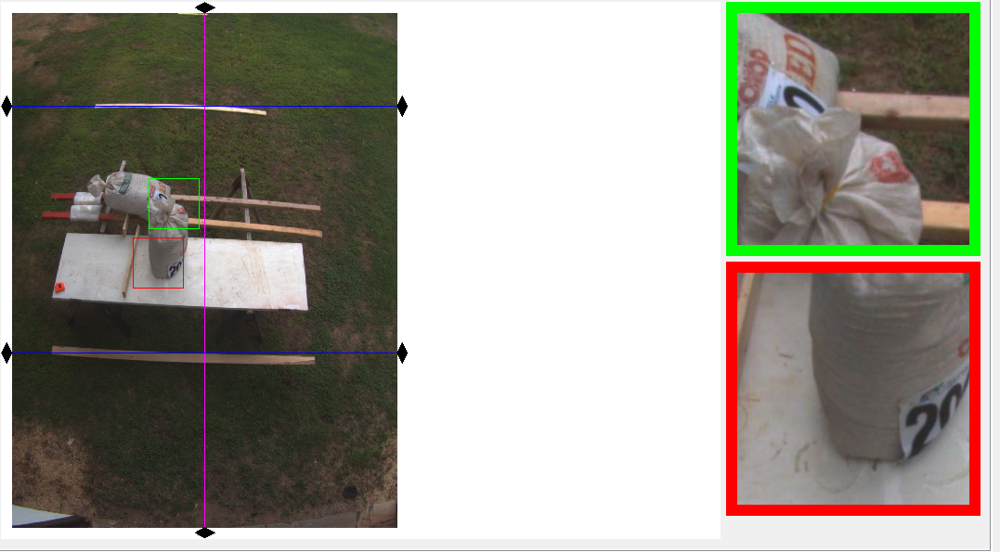
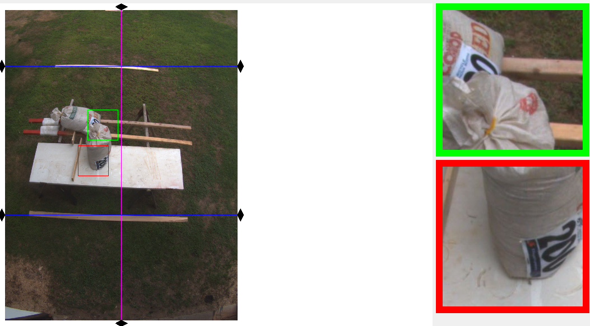
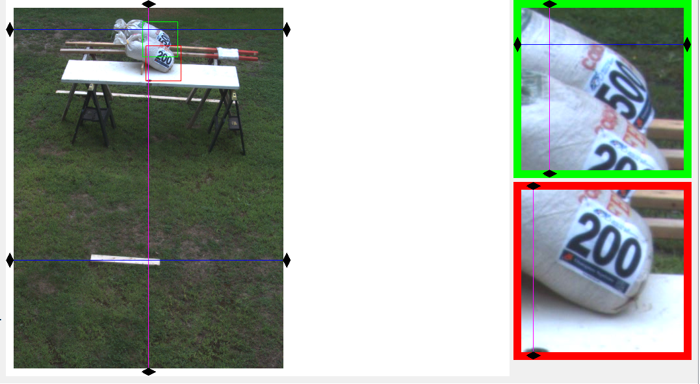
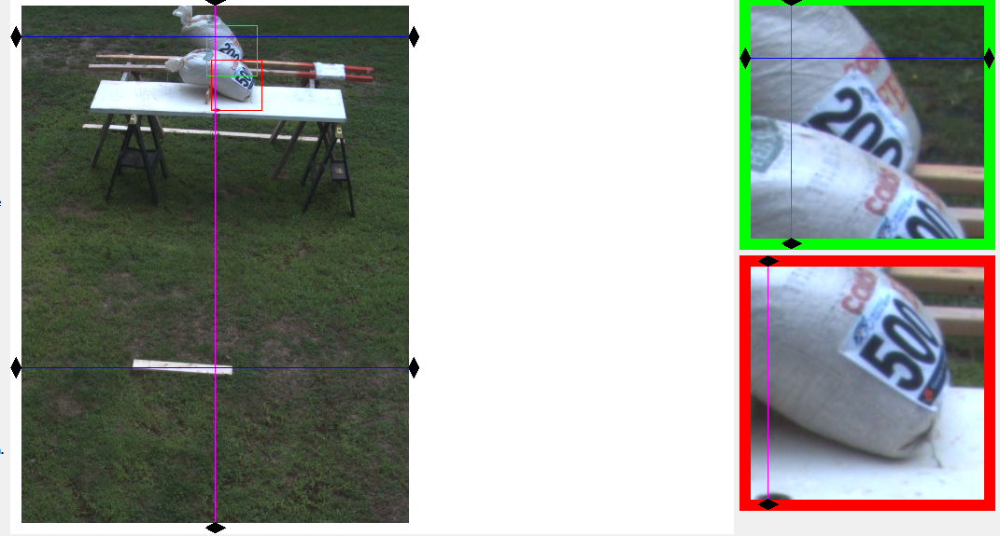
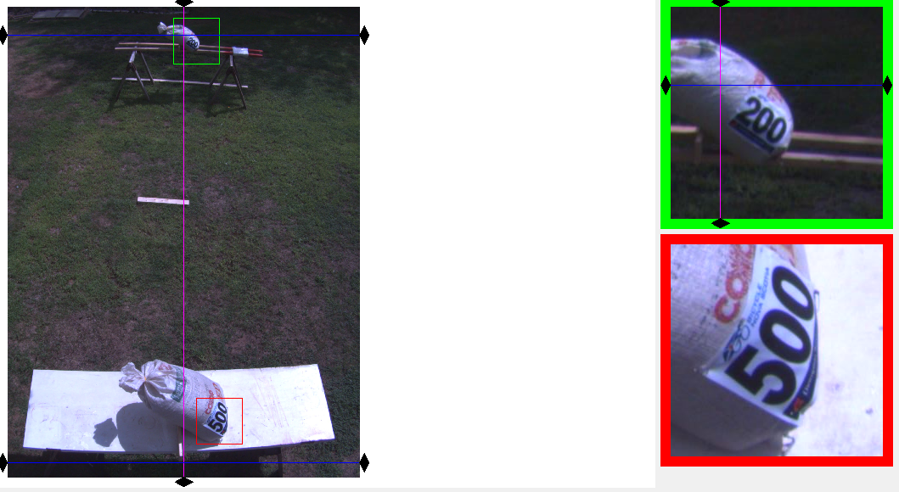
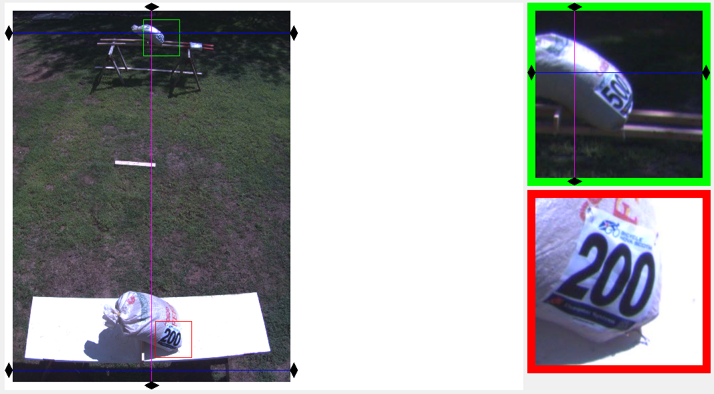

## Importance of correct bib number orientation for photo finish cameras.

This brief study will explore various configurations for the attachment of bib numbers to a cyclist and the impact they have on postive identification.

--- 
#### Parameters
##### Camera
* Height: **3.5 m**  
* Offset from fictional shoulder vertical plane: **1 m**

##### Road
* Lane width: **3.5 m**  
* Full road width: **9.0m**

##### Bib numbers
* `200`
* `500`

#### Notes and definitions.
The two parallel rails supporting a bag **do not** represent the center double line of a road. Another wide plank was not available.  

Green and red borders indicate near and far subjects respectively.

A *number* is a group of digits on a single piece of material.

A *vertical number* is defined by a top-to-bottom layout, whilst a *horizontal number* is when the numbers are layed out left-to-right. Both are determined when the cyclist is standing and with the observer's vision level with the horizon.

## Diagrams.
### Finish line cross-section.
If the camera was lower than 3.5 meters, the second rider from the right could have a partially occulted number.

### Number placement.

# Adjacent lane.

### *Normal riding position*.
Both numbers in both sets are clearly visible with no occultation or obscuring by riders in the foreground. This state **only applies** if the number is pinned on the side pocket in the direction of the camera and the rider is in the lane adjacent to it. The UCI specifies a mininum of 5 cm between numbers.

If a second number were to be pinned on the opposite side of the body, the horizontal orientation will have the second and third digit obscured by curvature which also results in only the tops of vertical numbers remaining visible. Either orientation would have a clear camera-facing number and a partially obscured opposite number.

#### Horizontal on pocket edge.

#### Vertical on pocket edge.

### *Upright riding position*.
The two following images simulate a cyclist sitting up while crossing the finish line. This is common celebratory behaviour that frequently results in not only the rider's numbers being obscured but also the occultation of those in the background.

In this position a vertical number is the most readable, however it should be noted that most riders crossing the line will be in the normal riding position, not the upright one.

#### Horizontal on pocket edge (Sitting upright).

#### Vertical on pocket edge (Sitting upright).

# Far lane.
The placing of a camera on the lane adjecent to the active lane is not always possible due to technicalities of the race course. The following two images simulate a camera on the opposite side of the road.

A vertical number is highly readable only when no riders are immediately adjacent however in a dense group horizontal numbers retain better overall readability.

#### Horizontal on pocket edge.

#### Horizontal on pocket edge.

# Double lane.
Riders crossing with abnormaly large spacing is not improbable at a full-width finish line. The camera's larger angle-of-view required to capture a complete frame results in more distinct differences in projection between near and far numbers.

Provided that the density of the rider's group is medium to low (discretion required), the vertical number has superior visibility in both positions whislt the horizontal number is best read only at close range.

#### Horizontal near.
* Both numbers retain sufficient readability.  
  

#### Vertical near.
* On horizontal-far the third digit partially obscured by the body's curvature.
* Vertical-near is highly readable.

---
#### Final notes.
Effortlessly enforcing the homologous placing of bib numbers on 50 to 100+ riders is made possible by taking advantage of common and well understood jersey features, along with adopting and practicing standarization of placement.  
This investigation could conclude that vertical or horizontal number placement has less of difference with regards to readability than attaching them consistently on the side-most section of the pocket area.
